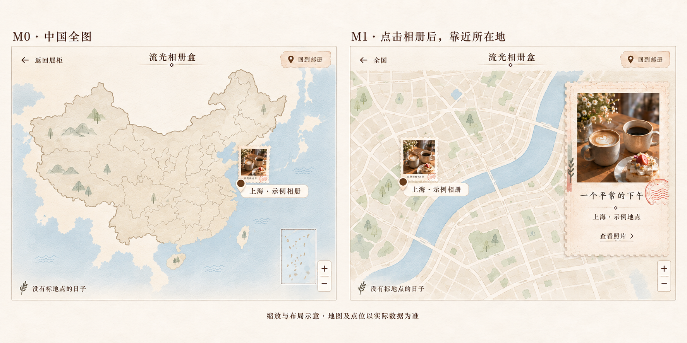

# 环绕邮册 · 示意图评审

配套 [PRD v2.1](PRD-2026-09-18.md)。用户对其余方向暂时认可，本次落实“去掉浏览提示和箭头、中国全图点击相册后放大”两项评审意见。只修订设计文档和静态图，没有修改页面实现或自行派发开发。

本页 r2 图为最新参考；未带 r2 的旧图只保留历史记录，底部浏览条与旧局部地图不再有效。

## 1. 桌面主图：S0 环绕浏览

评审重点：

- 以暖白纸面、邮票齿孔、薄纸阴影、朱印和一处粉色票根建立手作感；照片保留自己的色彩。
- 前景、中景与后景使用不同尺度、偏转和遮挡，形成环绕空间。图中是一个静止时刻，拖动时必须真正发生前后位置交换。
- 固定控件只有返回、小标题、地图切换和低强调筛选；底部中心留白。直接拖动/滚轮浏览，无左右浏览箭头、分页圆点、操作教程，不恢复多排标签与列表。
- 背景叶影为可删减装饰，不能抢照片，也不应在低性能或短屏场景中成为负担。

## 2. 补充状态：点击层次、地图与手机

1. **第一次点击 / S1：**选中邮票放大并呈现标题，背景邮票退后。点击大图或“进入相册”才进入下一层；移除“再点一次”等教学文案。
2. **再次点击 / S2：**在当前视口查看所属相册，从选中照片开始；一屏一张，原比例完整显示，直接滑动/滚轮切换，移除两侧切图箭头。保留角落张数和必要的返回、读小记入口。
3. **地图：**初次进入显示中国全图，相册封面作为入口；点击相册后地图靠近所在地，详见下方 M0/M1 图。无地点的日常照片有独立可达入口。
4. **手机：**减少可见邮票，保留前后层次；底部浏览箭头、圆点和滑动提示一起删除，不产生下方照片列表。

### 地图：全国态与定位态

- M0 按相册显示封面，不把一册的全部照片在全国图上展开成点。
- 点击相册后进入 M1，地图放大并平移到该册确认的位置；相册预览和标记同时可见。这个点击只用于定位，不直接跳过 S1/S2。
- M1 左上“全国”返回 M0；右上“回到邮册”切换模式。查看照片后退出，恢复原地图视域。
- 地图中的街区只表达缩放层级。只有城市信息时停在城市尺度，不能照示意图编造街道或坐标。

## 3. 图稿与真实产品的边界

- 图中照片、题签与计数均为合成示意；不代表用户的真实内容，不用于填充正式内容仓储。没有将用户原始照片提供给生成工具。
- 沿用“一张照片一枚邮票，进入所属相册”的环绕组织，仍保留按经历成组的关系；地图全国态按相册显示封面入口，共用同一套内容关联。
- 纸面文字必须在开发时使用真实文本，使用项目字体和语义令牌，不把整张生成图作为页面背景交付。
- 日期与地点属于聚焦/查看态的次要信息区：有确认值时置于标题下方一行；缺失时不显示虚构占位事实。图中为避免编造真实信息而省略，不能据此从产品中删除日期和地点。
- 图中的中国地图与局部地图均为构图示意；生成图的边界、地名、街道与标记位置不能作为地理数据依据。实际地图须采用可靠地图数据和确认的坐标，统一全国/局部底图来源，不能把这张插画当作真实地图。
- 图中的照片裁切和光影仅用于表达视觉方向；实际查看态必须保留原比例与原色。印章、纸纹和齿孔不得遮挡照片主体。
- 主图不再显示位置条或分页圆点；真实索引用于内部状态和辅助技术。进入单张查看后可保留角落的“当前 / 本册总数”，不与箭头组合成浏览控制条。
- 手机图只表达构图方向，不能代替 360×640、横屏短屏、200% 文字缩放、安全区和 44px 点击热区实测。
- 静态图不能证明轮播、无滚动、键盘可达或性能通过；执行会话须交付操作录像和 PRD 所列验收证据。

## 4. 本轮评审记录

1. 已落实：删除底部“左右拖动，慢慢翻看”、左右箭头及其浏览条；手机和其他照片浏览态同步删除冗余提示。
2. 已落实：中国全图起步，点击相册后放大到确认的更精确位置，保留全国复位。
3. 沿用：手作纸物、环绕空间、配色、两阶段点击与分组关系。用户对其余方向暂时认可，不重新展开整套风格选择。

单屏、无纵向滚动、少标签、保留日期地点和评审后再开发已确定。本次评审不重新讨论是否允许长页面。

## 5. 生成记录

- 使用内置 imagegen 生成主图，随后定向减少背景道具、强化空间层次；补充状态图参照修订后的主图生成。
- [提示词与生成记录](references/orbit-prompts-2026-09-18.md)。交付图已复制到本项目目录，原始生成文件保留。
- 本轮沿用 imagegen 精确编辑原图，并补充地图定位图；[r2 修订提示词](references/orbit-prompts-2026-09-18-r2.md)。原图不覆盖，执行只使用 r2 交付图。
- 原参考来源与吸收方式见 [PRD 第 3 节](PRD-2026-09-18.md#3-对参考的实际转化)；没有复制参考项目的图片或实现代码。

## 6. 交付检查

- r2 修订后，当前 PRD 与评审说明中的 18 个本地文档/图片链接检查通过；过时的浏览提示与箭头要求已核对清除。
- 2026-09-18 执行 `Cabinet/npm run verify` 通过：类型检查、构建、性能预算、草稿泄漏、文档链接与关键路由检查。
- 上述结果仅说明当前仓库检查通过，不代表新版环绕交互已实现或验收。当前页面的浏览器预览连接超时，本轮实现核对依据为源码和用户反馈。
